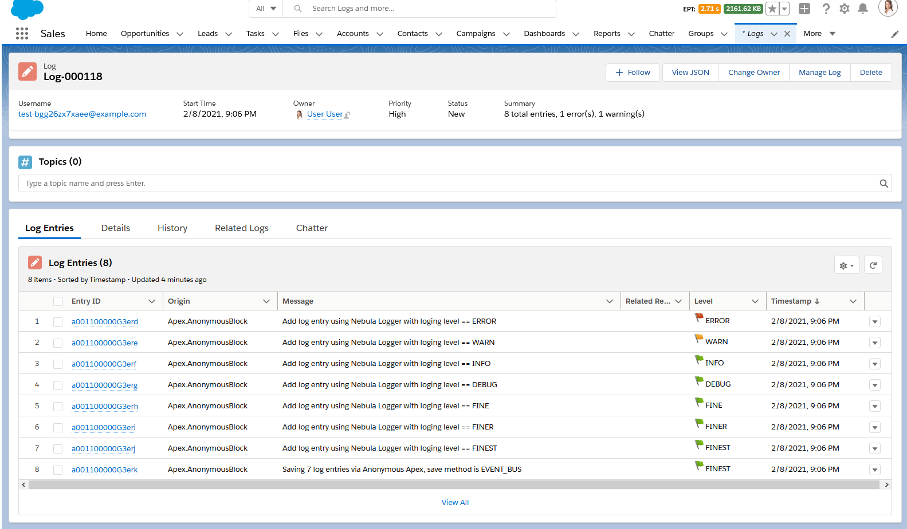
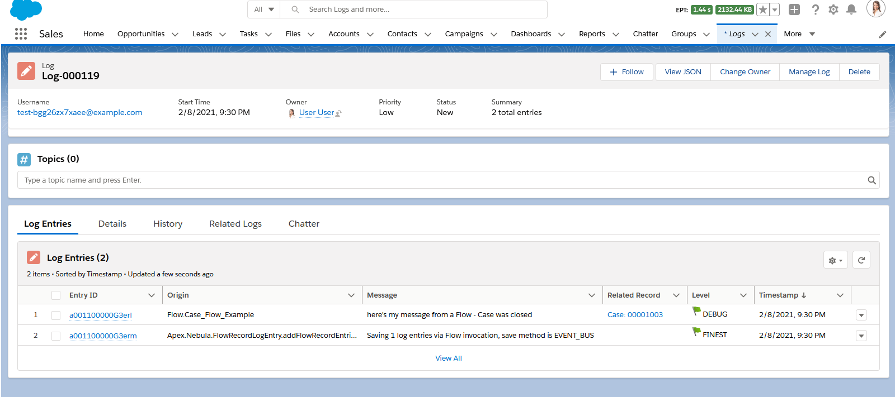

# Nebula Logger for Salesforce
[](https://travis-ci.org/jongpie/NebulaLogger)

<a href="https://githubsfdeploy.herokuapp.com" target="_blank">
    
</a>

A robust logger for Apex, Flow and Process Builder. Designed for Salesforce admins, developers & architects.

## Features
1. Easily add log entries via Apex, Flow & Process Builder
2. Manage & report on logging data using the `Log__c` and `LogEntry__c` objects
3. Leverage `LogEntryEvent__e` platform events for real-time monitoring & integrations
4. Easily enable logging & change the logging level for different users & profiles using `LoggerSettings__c` custom hierarchy setting


## Getting Started
After deploying Nebula Logger to your org, it can be used immediately by admins without any additional configuration. But you may still want to...
* Assign the permission set `LoggerEndUser` to any end users that will generate logs via Apex, Flow or Process Builder
* Assign the permission sets `LoggerLogAdmin` or `LoggerLogViewer` to power users
* Customize the default settings in `LoggerSettings__c`

## Logger for Apex: Quick Start
For Apex developers, the `Logger` class has several methods that can be used as replacements for `System.debug()`.

```java
// This will generate a debug statement within developer console
System.debug('Debug statement using native Apex');

// This will create a new `Log__c` record with multiple related `LogEntry__c` records
Logger.error('Add log entry using Nebula Logger with loging level == ERROR');
Logger.warn('Add log entry using Nebula Logger with loging level == WARN');
Logger.info('Add log entry using Nebula Logger with loging level == INFO');
Logger.debug('Add log entry using Nebula Logger with loging level == DEBUG');
logger.fine('Add log entry using Nebula Logger with loging level == FINE');
logger.finer('Add log entry using Nebula Logger with loging level == FINER');
logger.finest('Add log entry using Nebula Logger with loging level == FINEST');
Logger.saveLog();
```


This results in 1 `Log__c` record with several related `LogEntry__c` records.



## Logger for Flow & Process Builder: Quick Start
Within Flow & Process Builder, you can select 1 of the several Logging actions


In this simple example, a Flow is configured after-insert and after-update to log a Case record (using the action 'Add Log Entry for an SObject Record')


This results in a `Log__c` record with related `LogEntry__c` records.



## All Together: Apex & Flow in 1 Log
After incorporating Logger into your Apex code (including controllers, trigger framework, etc.) and Flows, you'll have a unified log of all you declarative & custom code automations.

```java
Case currentCase = [SELECT Id, CaseNumber, Type, Status, IsClosed FROM Case LIMIT 1];

Logger.info('First, log the case through Apex', currentCase);
Logger.debug('Now, we update the case in Apex to trigger our record-triggered Flow', currentCase);

update currentCase;

Logger.info('Now, save our log');
Logger.saveLog();
```

This generates 1 consolidated `Log__c`, containing `LogEntry__c` records from both Apex and Flow


## Managing Logs
To help development and support teams better manage logs (and any underlying code or config issues), some fields on `Log__c` are provided to track the owner, priority and status of a log. These fields are optional, but are helpful in critical environments (production, QA sandboxes, UAT sandboxes, etc.) for monitoring ongoing user activities.
* All editable fields on `Log__c` can be updated via the 'Manage Log' quick action
* Additional fields, such as `Log__c.IsClosed__c`, `Log__c.ClosedBy__c` and `Log__c.ClosedDate__c`, are automatically set based on changes to `Log__c.Status__c`.
* To customize the statuses provided, simply update the picklist values for `Log__c.Status__c` and create/update corresponding records in the custom metadata type `LogStatus__mdt`. This custom metadata type controls which statuses are considerd closed and resolved.

## Deleting Old Logs
Two Apex classes are provided out-of-the-box to handle automatically deleting old logs
1. `LogBatchPurger` - this batch Apex class will delete any `Log__c` records with `Log__c.LogRetentionDate__c <= System.today()`.
   * By default, this field is populated with "TODAY + 14 DAYS" - the number of days to retain a log can be customized in `LoggerSettings__c`.
   * Users can also manually edit this field to change the retention date - or set it to null to prevent the log from being automatically deleted
2. `LogBatchPurgeScheduler` - this schedulable Apex class can be schedule to run `LogBatchPurger` on a daily or weekly basis